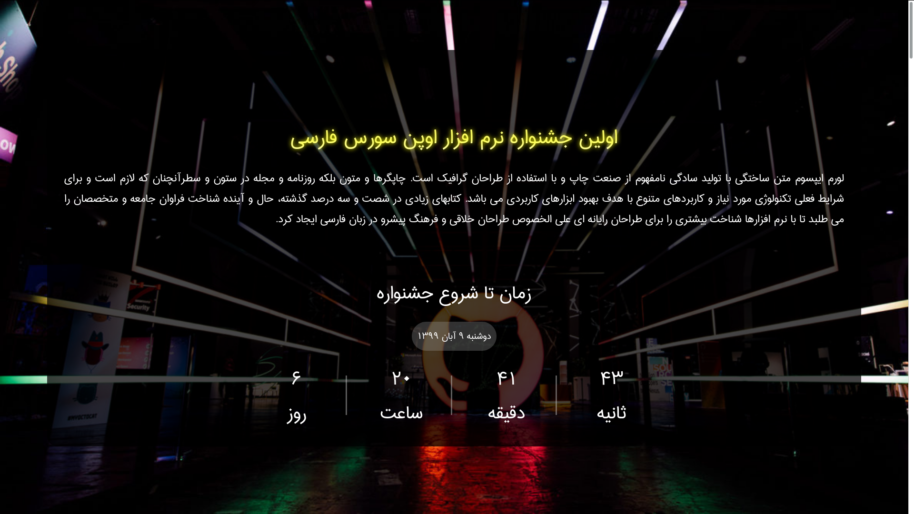
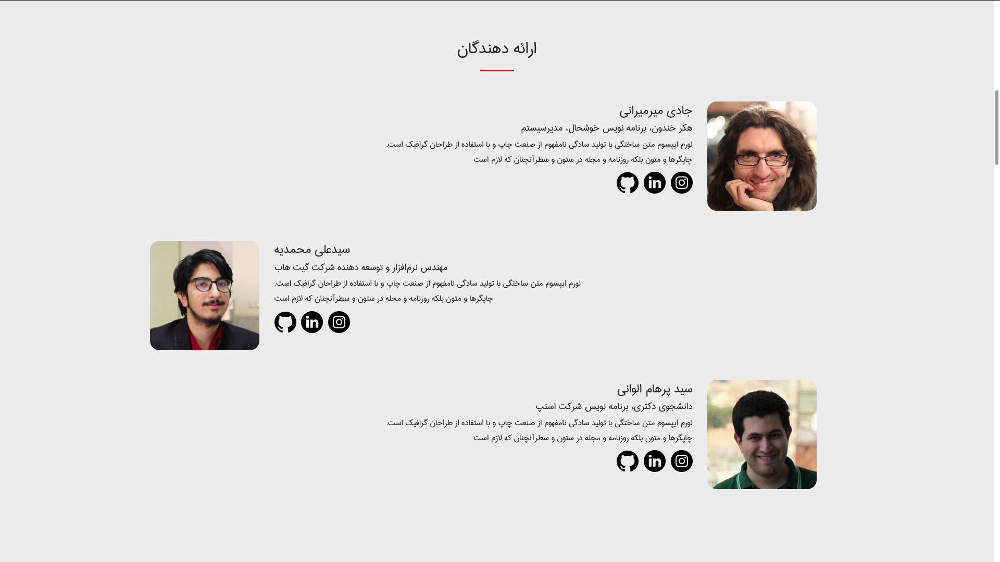
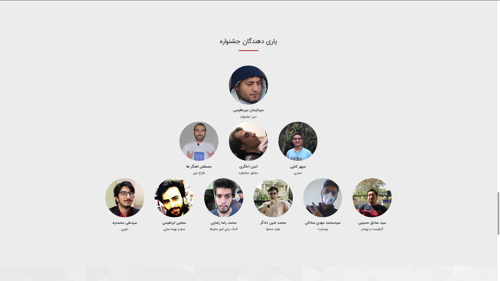

# POSSF

Persian Open Source Software Festival

## Event type

Open-Source Festival similar to **Hacktoberfest** but specifically for Persian users of the world.

> Online (due to COVID 19 disease)

## Purpose of POSSF

- Help free software
- Help expand open source activities
- Increasing the number of Iranians participating in these activities
- Increasing the scientific level of people with several training courses and workshops
- Identify people active in open source and in the next step identify quality projects
- Offer prizes to eligible individuals if they participate in the open source community this month

## Do you agree to speak at POSSF event?

Please mail me at my gmail address (maxbasecode)

## Date of POSSF event

20 November 2020

Group are coordinating, Date can be changed.

---------

